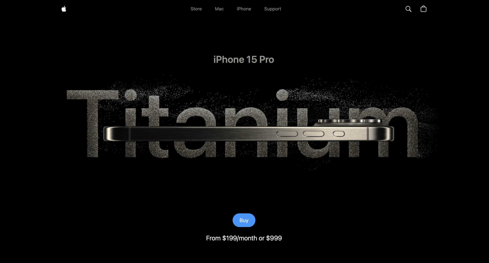

<div align="center">
<h1>iPhone 15 Landing Page</h1>
<p>iPhone 15 Pro clone landing page <a href="https://www.anayathawale-phone.online">website</a></p>
</div>

## Snapshot 📸



## Tech Stack ✨

- [React.js](https://reactjs.org/) - UI Library
- [Tailwind CSS](https://tailwindcss.com/) - Styling and UI
- [GSAP](https://gsap.com/) - Animations
- [Three JS (React Three)](https://www.npmjs.com/package/react-three) - 3D model interaction
- [Lenis (React Lenis)](https://www.npmjs.com/package/@studio-freight/react-lenis) - Smooth Scrolling
- [Vite](https://vitejs.dev/) - Build tool

## Run locally 💻

Follow these steps to run locally in your machine.

### Clone this repository

```bash
git clone https://github.com/anayathawale/Apple_clone.git
```

### Navigate to directory

```bash
cd Apple_clone
```

### Install dependencies

```bash
npm install
```

### Run

Run the development server to view the app.

```bash
npm run dev
```

Navigate to http://localhost:5173/ 

### Build

```bash
npm run build
```
